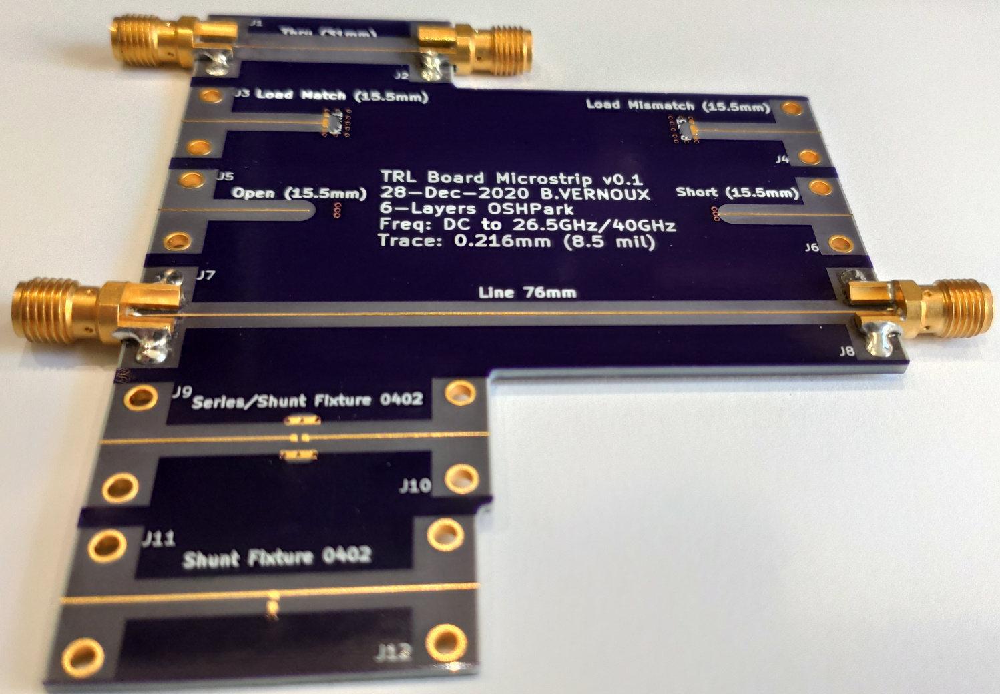
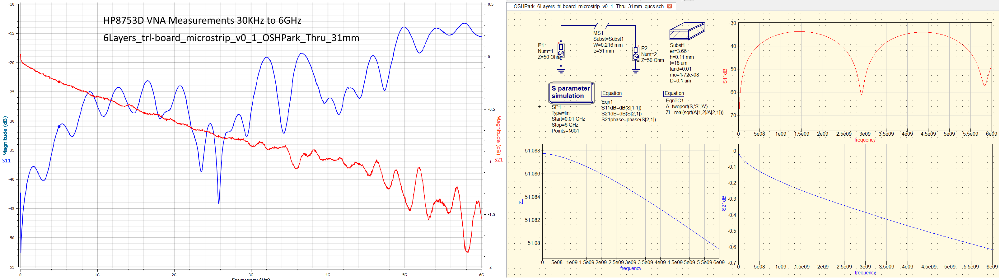
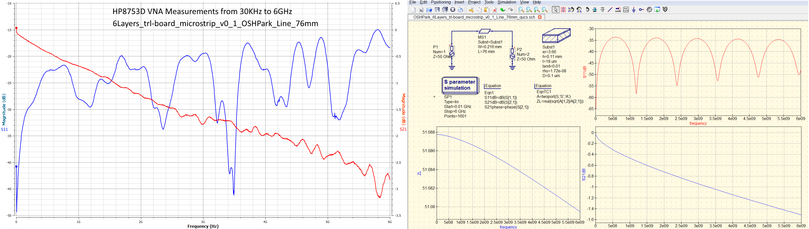
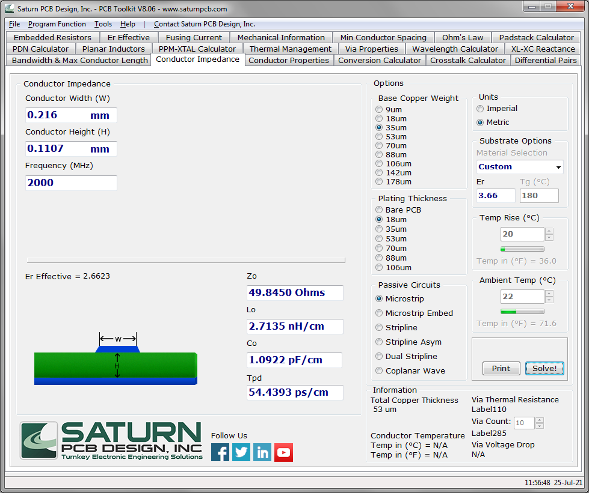

6Layers_trl-board_microstrip_v0_1
==============================

This board is based on Mario Hellmich's design see https://www.mariohellmich.de/projects/trl-cal/trl-cal.html

TRL Calibration Board for evaluation of Southwest Microwave 1092-02A-5(up to 40 GHz) or BELFUSE / Cinch 142-0771-831(Up to 26.5GHz) or cheap SMA connectors.
50 Ohms Impedanced Matched with OSHPark 6Layers FR408-HR

It contains following features:
* A thru standard for TRL
* A 50 Ohms match standard
* A 25 Ohms mismatch standard for verification
* An open standard for verification
* A short standard, used as a reflect standard for TRL
* A line of 45 mm length (Called also "Line 76mm" to reflect total length), used as a line standard for TRL
* A series fixture for 0402 components
* A shunt fixture for 0402 components

The board is designed assuming the following parameters (based on [OSH Park 6 Layers 190Tg FR408-HR specifications](https://docs.oshpark.com/services/six-layer)):
* Base Material / Board thickness: 1.6 mm (63 mil)
* Conductor Height: 0.1107 mm (4.36 mil) FR408-HR
* Trace: 0.216mm (8.5mil)
* Permittivity: FR408-HR 106 75% prepreg about 3.66 (3.23@1GHz)
* Loss Tangent: 0.011
* Copper Weight: 1oz outer (35µm), 1/2oz inner (17.5µm)
* Trace surface: 1 oz copper clad+plated
* Impedance: 50 Ohms (+/-10% => +/-5 Ohms)
* PCB Finish: ENIG (Gold)

For more details on TRL see https://www.mariohellmich.de/projects/trl-cal/trl-cal.html
