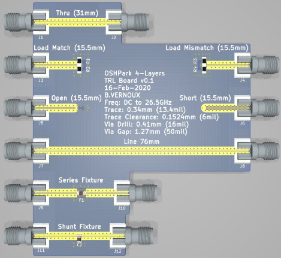
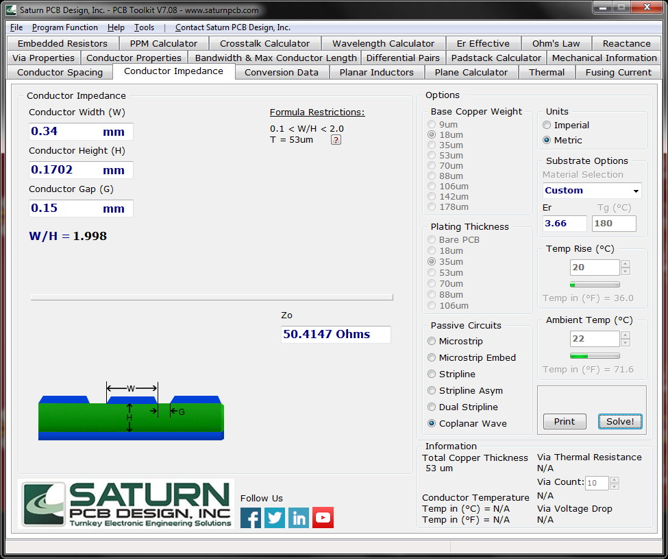

OSHPark_4Layers_trl-board_v0_1
==============================

This Board is based on Mario Hellmich's design see https://www.mariohellmich.de/projects/trl-cal/trl-cal.html

TRL Calibration Board for evaluation of SMA BELFUSE 142-0771-831(Up to 26.5GHz) connectors and for experimentation on series/shunt fixtures.

It contains following features:
* A thru standard for TRL
* A 50 Ohms match standard
* A 25 Ohms mismatch standard for verification
* An open standard for verification
* A short standard, used as a reflect standard for TRL
* A line of 45 mm length (Called also "Line 76mm" to reflect total length), used as a line standard for TRL
* A series fixture for 0805 components
* A shunt fixture for 0805 components

The board is designed assuming the following parameters (based on [OSH Park 4 Layers 190Tg FR408-HR specifications](https://docs.oshpark.com/services/four-layer)):
* Base Material / Board thickness: 1.6 mm (63 mil)
* Center Conductor Width: 0.34036 mm (13.4 mil)
* Gap Width: 0.1524 mm (6 mil)
* Permittivity: 3.66 (3.68 @2GHz)
* Loss Tangent: 0.0092 @2GHz
* Copper Weight: 1oz outer (35µm), 1/2oz inner (17.5µm)
* Trace surface: Cu
* Impedance: 50 Ohms (+/-2 Ohms)
* PCB Finish: ENIG (Gold), compliant with IPC-4552

For more details on TRL see https://www.mariohellmich.de/projects/trl-cal/trl-cal.html
